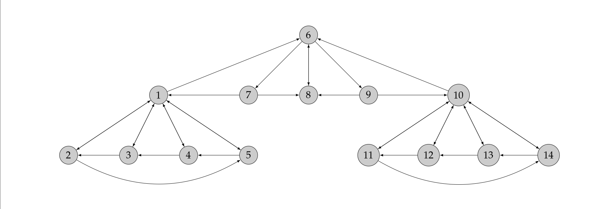
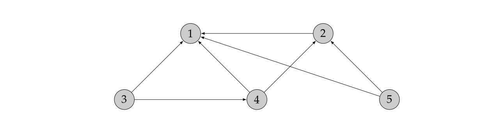

# SAE S2.02 — Exploration algorithmique d'un problème
## PageRank & applications

**IUT Aix-Marseille Université — Année 2025-2026**  
**Département Informatique Aix**

---

L'objectif de cette SAE est d'étudier une méthode de classement des pages d'un graphe orienté, une version simplifiée de l'algorithme d'ordonnancement **PageRank**, basée sur la structure des liens entre ces pages. On s'intéressera à un algorithme itératif qui propage progressivement une quantité appelée "score" à travers le réseau, et à son comportement en fonction de la structure du graphe. L'analyse portera sur la convergence de cet algorithme, les résultats obtenus, ainsi que leur interprétation.

---

## Consignes

Pour la partie implémentation, vous utiliserez **Python** ou **Sagemath** avec les bibliothèques nécessaires. Pour le rapport, afin de présenter du texte, du code ainsi que le rendu du code, on utilisera **jupyter-notebook** (installé en local sur les ordinateurs du département).

Le rapport rendant compte du projet est à rendre au format `.ipynb` et au format **HTML** (généré depuis jupyter-notebook). Les consignes précises de rendu sont détaillées sur la page AMeTICE de la SAE.

Le dossier devra contenir les réponses aux 5 parties décrites ci-dessous. Il est bien évidemment attendu que vous compreniez le fonctionnement de l'algorithme PageRank présenté dans la section ci-dessous mais dans le document à rendre il n'est pas nécessaire de re-détailler le fonctionnement de cet algorithme.

Bien évidemment la totalité du rendu aura été écrit par l'un des membres du groupe. Le recours à toute aide extérieure est interdit.

---

## Principe de PageRank

La recherche d'informations pertinentes sur le Web est un des problèmes les plus cruciaux pour l'utilisation de ce dernier. Il y a des enjeux économiques colossaux. Le leader actuel de ce marché, Google, utilise pour déterminer la pertinence des références fournies, un certain nombre d'algorithmes dont certains sont des secrets industriels jalousement gardés, mais d'autres sont publics.

On va s'intéresser à (une partie de) l'algorithme **PageRank** conçu par Larry Page et Sergey Brin entre 1996 et 1998. L'idée de base utilisée par les moteurs de recherche pour classer les pages du web par ordre de pertinence décroissante consiste à considérer que plus une page est la cible de liens venant d'autres pages, c'est-à-dire plus il y a de pages qui pointent vers elle, plus elle a de chances d'être fiable et intéressante, et réciproquement. Il s'agit donc de quantifier cette idée, c'est-à-dire d'attribuer un rang numérique ou **score de pertinence** à chaque page.

On numérote les pages du web de `1` à `N` (N est très grand, de l'ordre de 10¹²) et on note `rᵢ > 0` le score de la page `i`. C'est ce score que l'on cherche à calculer.

On considère le Web comme un graphe orienté (vu en détails dans le TP de R2.07 dédié à la SAE) dont les sommets sont les pages numérotées de `1` à `N`. Il y a une arête de `i` vers `j` s'il y a sur la page `i` un lien hypertexte vers la page `j` (on dit que `i` pointe vers `j`). On définit la matrice `C = (cᵢⱼ)` de taille N × N par :

$$c_{i,j} = \begin{cases} 1 & \text{si } j \text{ pointe vers } i \text{ et } i \neq j \\ 0 & \text{sinon} \end{cases}$$

C'est donc la matrice transposée de la matrice d'adjacence du graphe du web.

L'algorithme PageRank part du principe que toutes les pages n'ont pas le même poids :
- plus la page `i` a un score élevé, plus les pages `j` vers lesquelles la page `i` pointe auront un score important ;
- plus il y a de liens différents sur la page `j`, moins on attribue d'importance à chaque lien.

Ainsi, en notant `Nⱼ` le nombre de liens présents sur la page `j`, on aboutit au système suivant :

$$r_i = \sum_{j=1}^{N} \frac{c_{i,j}}{N_j} \times r_j, \quad \text{pour tout } i \in \{1, \ldots, N\}$$

On pourra remarquer que $N_j = \sum_{k=1}^{N} c_{k,j}$.

Finalement en adoptant les notations matricielles suivantes :

$$r = \begin{pmatrix} r_1 \\ \vdots \\ r_N \end{pmatrix} \in \mathbb{R}^N \quad \text{et} \quad Q = (q_{i,j}) \text{ avec } q_{i,j} = \begin{cases} \dfrac{c_{i,j}}{N_j} & \text{si } N_j \neq 0 \\ 0 & \text{sinon} \end{cases}$$

on aboutit à l'équation suivante : le vecteur `r` des scores est solution de

$$r = Qr$$

L'algorithme PageRank peut être utilisé pour des graphes qui ne sont pas associés au graphe du Web ; dans ce cas ses résultats nécessitent une interprétation précise.

---

## Partie 1 : PageRank — version itérative, premier exemple

On considère le graphe du web simplifié suivant (avec N = 14 pages) :

1. Justifier pourquoi l'application de l'algorithme de la puissance itérée à la matrice `Q` (vu en détails dans le TD de R2.09 dédié à la SAE) permet de calculer le score de chacune des pages.

2. Implémenter cet algorithme pour calculer le score de chacune des pages du graphe précédent. On vérifiera (numériquement) que le vecteur de score obtenu est bien approximativement solution de `r = Qr`.

3. Analyser qualitativement la pertinence du résultat obtenu.

---

## Partie 2 : PageRank — version itérative, deuxième exemple

1. Appliquer l'algorithme de la Partie 1 au graphe suivant et commenter le résultat obtenu :

Pour éviter cela, on appliquera désormais l'algorithme de la puissance itérée à la **matrice de transition** `P = (pᵢⱼ)` définie par :

$$p_{i,j} = \begin{cases} \alpha \, q_{i,j} + \dfrac{1-\alpha}{N} & \text{si } N_j \neq 0 \\ \dfrac{1}{N} & \text{sinon} \end{cases}$$

où `α ∈ [0, 1]` est un paramètre à choisir appelé **"facteur d'amortissement"**.

2. En utilisant cette matrice de transition (avec `α = 0,85`), calculer les scores de chacune des pages du graphe précédent. On vérifiera (numériquement) que le vecteur de score obtenu est bien approximativement solution de `r = Pr`. Analyser qualitativement la pertinence du résultat obtenu.

Dans la suite c'est cet algorithme que l'on désignera par **PageRank version itérative**. Il est appelé itératif car il calcule successivement des approximations du vecteur de score `r` cherché.

---

## Partie 3 : PageRank — version itérative, analyse des paramètres

Pour le moment on pose `α = 0,85` et on considère le graphe de la Partie 1.

1. Analyser l'influence du critère d'arrêt dans l'algorithme de la puissance itérée.

2. Ajouter quelques **hubs** (pages qui ont beaucoup de liens sortants) et **autorités** (pages qui ont beaucoup de liens entrants). Commenter l'impact sur les scores.

3. Essayez d'accroître le score de certaines pages. Expliquez votre méthode et validez-la expérimentalement.

4. Faites varier le facteur d'amortissement `α` pour analyser son influence. On rappelle que `α ∈ [0, 1]`.

---

## Partie 4 : PageRank — version itérative, analyse des résultats

Dans cette partie, vous appliquerez l'algorithme de PageRank version itérative à différents graphes. L'objectif principal n'est pas uniquement de calculer les scores, mais d'**analyser et d'interpréter les classements obtenus** à la lumière de la structure du graphe étudié. On s'attachera notamment à expliquer pourquoi certains sommets obtiennent un score élevé ou faible, en s'appuyant sur leurs liens entrants, leurs liens sortants et leur position dans le réseau.

Les différentes matrices mentionnées ci-dessous sont disponibles sur la page AMeTICE.

1. En utilisant le logiciel d'exploration de site web présent sur la page AMeTICE (et vu en TP de R2.07), construire trois matrices de votre choix et appliquer l'algorithme de PageRank à ces matrices. L'ordre de ces matrices sera compris entre 10 et 30. Appliquer l'algorithme de PageRank à chacune d'elles et analyser les classements obtenus en les confrontant à la structure du site exploré. Les matrices, le résultat du logiciel d'exploration ainsi que le site web choisi devront apparaître clairement dans le dossier.

2. Sur la page AMeTICE vous trouverez des matrices représentant différents **réseaux sociaux**. Chaque groupe étudiera uniquement la matrice qui lui a été affectée. Dans le graphe associé, les sommets représentent des comptes et il existe une arête de `i` vers `j` lorsque le compte `i` est abonné au compte `j`.

   Établir dans un premier temps le classement des comptes en fonction de leur nombre d'abonnés. Appliquer ensuite l'algorithme de PageRank version itérative et comparer le classement obtenu avec celui basé uniquement sur le nombre d'abonnés. Les écarts observés devront être expliqués en s'appuyant sur la structure du réseau et sur le rôle joué par les comptes.

---

## Partie 5 : PageRank — calcul direct des scores et comparaisons d'algorithmes

1. On rappelle que le vecteur de score est solution du système `r = Pr`. En déduire un algorithme de **calcul direct** (c'est-à-dire de calcul exact et sans approximations successives) du score `r`. Écrire le pseudo-code correspondant à cet algorithme.

2. Implémenter cet algorithme (il ne s'agit pas d'un appel à une fonction existant dans une bibliothèque).

3. Comparer les résultats obtenus par les deux algorithmes.

4. Comparer les performances des deux algorithmes. Si le temps d'exécution peut être un indicateur pertinent, ce n'est pas le seul.
